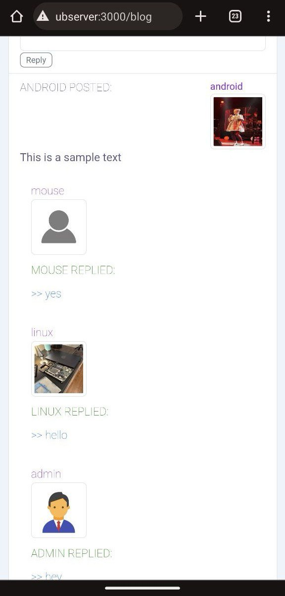

# full-stack-personal-adds-website

This is a small social network built with Express.js, Javascript, PostgreSQL, Javascript Web-token authentication.

It has login/register option, private messages from user to user, viewing user's account info, writing posts, deleting posts, leaving replies to posts, searching users in the database.

deployment instructions for Ubuntu Server:

#!/bin/bash
#THis is a script that deploys the project to pristine ubuntu server, 
#(commented commands at the bottom of the script need to be run manually after running the script)

# installs NVM (Node Version Manager)

curl -o- https://raw.githubusercontent.com/nvm-sh/nvm/v0.39.7/install.sh | bash

# installs git

sudo apt install git-all

# download application from GitHub

git clone https://github.com/Anton718/nestjs-authentication1.git

# Create the file repository configuration for postgres:
sudo sh -c 'echo "deb https://apt.postgresql.org/pub/repos/apt $(lsb_release -cs)-pgdg main" > /etc/apt/sources.list.d/pgdg.list'

# Import the repository signing key:
wget --quiet -O - https://www.postgresql.org/media/keys/ACCC4CF8.asc | sudo apt-key add -

# Install the latest version of PostgreSQL.
sudo apt -y install postgresql

# creating password for user 'postgres'

sudo -u postgres psql -c "ALTER USER postgres PASSWORD 'postgres';"

# create database

sudo -u postgres psql -c 'create database "nest-data"'

##########################################
# BELOW COMMANDS NEED TO BE RUN MANUALLY #
##########################################

# nvm install 21

# cd /home/user/nest*

# npm install
